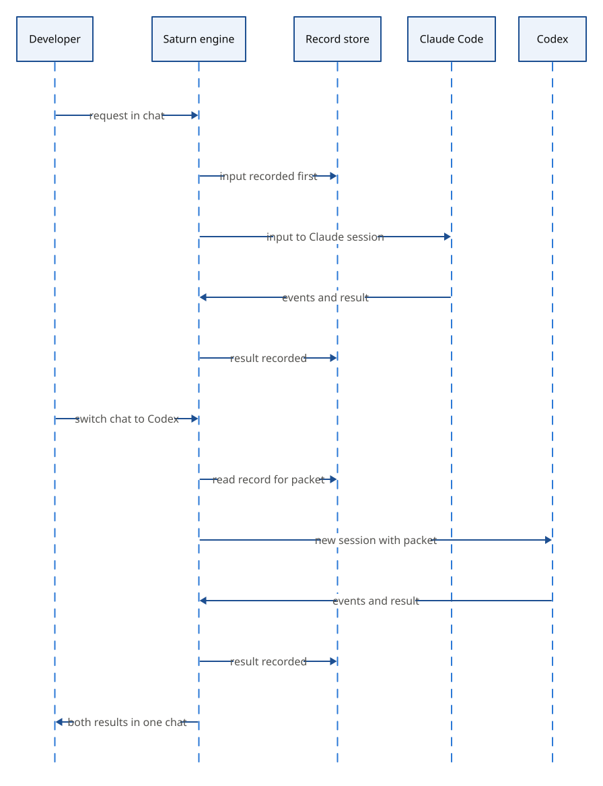

<p align="center">
  <picture>
    <source media="(prefers-color-scheme: dark)" srcset="docs/assets/logo-dark.png">
    
  </picture>
</p>

<h1 align="center">Saturn</h1>

<p align="center">
  Codex와 Claude Code를 하나의 대화로 이어 쓰는 터미널 도구입니다.
</p>

<p align="center">
  <a href="README.md">English</a> | 한국어<br>
  <a href="#작동-방식">작동 방식</a> · <a href="#상태">상태</a> · <a href="#로드맵">로드맵</a> · <a href="#문서">문서</a>
</p>

Codex와 Claude Code를 함께 쓰는 개발자는 provider마다 session과 압축 방식이 달라서 도구를 바꿀 때마다 맥락을 잃습니다. Saturn은 모든 입력을 보내기 전에 로컬에 기록하고, 그 기록에서 각 provider session에 필요한 맥락만 골라 넘깁니다. 도구마다 터미널을 따로 띄우는 방식과 달리, provider를 바꾸거나 작업을 병렬로 돌리거나 새 session을 열어도 한 채팅의 기록과 작업 상태가 이어집니다.

> [!NOTE]
> 개발 중입니다. 실행할 수 있는 명령은 아직 없습니다.



## 작동 방식

아래는 설계한 동작입니다.

1. 저장소에서 `saturn`을 실행하고 요청을 입력합니다. 뒤에서 도는 engine 프로세스가 Codex나 Claude Code에 보내기 전에 입력을 로컬 SQLite 데이터베이스에 저장합니다.
2. 에이전트가 일하는 동안 이어지는 요청을 입력합니다. 입력에 대한 예·아니요, 선택형, 등급형 질문에 답하는 작은 모델인 router가 진행 중인 턴에 더할지, 별도 작업으로 시작할지, 대기열에 둘지 정합니다.
3. session의 맥락이 정해 둔 토큰 기준을 넘고 실행 중인 작업이 없으면, Saturn은 provider에 압축을 맡기거나 비용이 더 적을 때 새 session을 엽니다. 새 session은 Saturn 기록에서 고른 목표, 최근 턴, 끝나지 않은 항목을 패킷으로 받습니다.
4. 채팅을 Claude Code에서 Codex로 바꿉니다. 채팅은 사용자가 보는 대화이고, provider session은 그 뒤에서 열리고 닫힙니다. 새 session은 그 채팅을 마지막으로 본 뒤 바뀐 내용만 받습니다.
5. 터미널을 닫습니다. engine은 이미 보낸 입력을 계속 처리하고, 나중에 다시 붙을 수 있습니다.
6. provider가 명령 실행이나 파일 수정을 요청합니다. Saturn은 provider 설정 대신 자체 권한 규칙을 적용하고, 규칙이 묻기로 정한 경우에만 허가 창을 보입니다.

전체 설계는 [설계 문서](docs/README.md)에 있고, 설계 문서는 한국어로 씁니다.

## 상태

Saturn은 개발 중입니다. 메시지 타입, core 규칙, engine, TUI, `saturn` 명령은 `main`에 있습니다. 입력 접수부터 provider 전송까지의 입력 흐름, 멈춤과 재개, Saturn 권한 규칙, `/model`, `/usage`는 가짜 provider를 쓴 테스트에서 동작하지만, 실제 Codex와 Claude Code로 처음부터 끝까지 돌린 확인은 아직 없고 TUI 없이 계속 실행과 크래시 뒤 복구는 만들지 않았습니다. 설계 문서, 결정 기록, 실험 보고서는 공개되어 있습니다. Apple Silicon macOS를 대상으로 하고 Codex CLI나 Claude Code가 필요합니다. 1.0 전까지 명령, 파일 형식, 동작이 예고 없이 바뀔 수 있습니다. 열린 설계 질문과 실험 계획은 [GitHub 이슈](https://github.com/woonyong-choi/saturn/issues)에 있고, 의견은 이슈 댓글로 받습니다.

## 비교

- Codex CLI나 Claude Code 단독 사용: 각자 session과 압축을 관리하고 별도 계층이 필요 없습니다. provider 하나만 쓴다면 그 도구를 바로 쓰는 편이 낫습니다.
- 두 도구를 터미널 두 개에서 실행: 병렬로 돌릴 수 있지만 맥락은 도구마다 따로이고, 도구 사이 맥락은 사람이 직접 옮깁니다. Saturn은 기록 하나를 두고 필요한 맥락을 provider 사이에 넘깁니다.

## 로드맵

첫 대화 이후의 순서는 아직 정하지 않았습니다.

1. 첫 대화: 실제 Codex와 Claude Code로 처음부터 끝까지 실행, 맥락 패킷의 사용자 제약, 빌드와 설치 안내. (진행 중)
2. 채팅 관리와 복구: TUI 없이 계속 실행, 크래시 뒤 복구, 채팅 이름과 묶음, 작업 완료 알림. (다음)
3. 로컬 router 모델: 판단 기록 채점, 개인 router 모델 학습, 같은 평가 세트에서 현재 router보다 나쁘지 않을 때만 교체. (나중)
4. 서비스: 동의 기반 데이터 수집, 원격 API, 인증, 인프라. (나중)

## 문서

설계 문서는 한국어로 씁니다.

- [아키텍처](docs/architecture.md): 코드 지도와 불변 조건
- [입력 처리](docs/design/input-handling.md): 입력 접수, 대기, 보류와 재개
- [provider 연결과 session](docs/design/providers-and-sessions.md): provider 연결, session 전환, subagent 추적
- [맥락 정리](docs/design/context-management.md): 맥락 측정과 새 session으로 이어 가기
- [결정 기록](docs/decisions/README.md): 설계를 정한 이유
- [전체 문서](docs/README.md)

## 개발

저장소 루트에서 다음 명령을 실행하세요. CI는 아직 없습니다.

```sh
cargo build --workspace
cargo test --workspace
```
