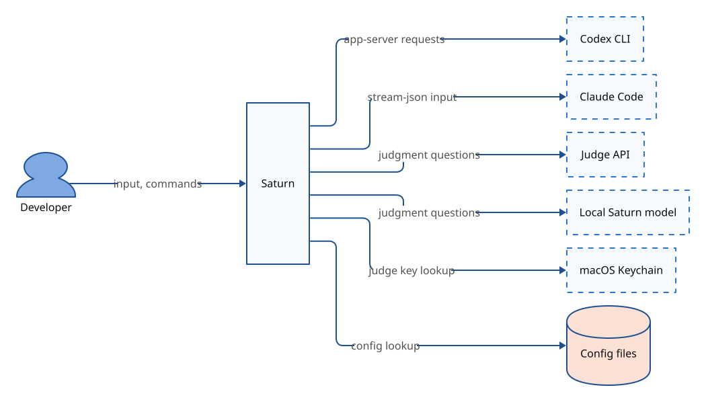

# 아키텍처

Saturn은 Codex와 Claude Code를 한 채팅으로 이어 쓰게 하는 로컬 터미널 도구다. 구성 요소는 코드 다섯과 기록 저장소 하나이고, `tui`와 `cli`는 사용자당 하나인 `engine`에 Unix 소켓 위 JSON-RPC로 붙는다.

## 맥락

| 외부 요소 | 종류 | 주고받는 것 |
|---|---|---|
| Codex CLI | 외부 프로그램 | app-server 요청, 이벤트, 사용량 보고 |
| Claude Code | 외부 프로그램 | stream-json 입력, 이벤트, 사용량 보고 |
| router API | 외부 서비스 | 판단 질문과 선택지별 확률 |
| 로컬 Saturn 모델 | 외부 프로그램 | 판단 질문과 선택지별 확률 |
| macOS 키체인 | 운영체제 | router 키 |
| `SATURN_KEY` 환경 변수 | 운영체제 | 키체인 확인에 실패할 때 받는 router 키 |
| 설정 파일 | 파일 | 사용자 설정과 폴더 설정 |

## 코드 지도

| 구성 요소 | 하는 일 | 기술 | 위치 |
|---|---|---|---|
| `protocol` | engine과 TUI가 주고받는 메시지 타입 정의 | Rust, `schemars`, `ts-rs` | `saturn-protocol` |
| `core` | 대기열, session, 에이전트 트리, 판단 규칙과 외부 연결 trait | Rust | `saturn-terminal/core` |
| `engine` | provider 연결, router 호출, 기록 저장, TUI 접속을 맡는 상주 프로세스 | Rust, `tokio` | `saturn-terminal/engine` |
| `tui` | 채팅 기록, 실행 영역, 상태판, 입력창을 그리는 전체 화면 | Rust, `ratatui`, `crossterm` | `saturn-terminal/tui` |
| `cli` | `saturn` 실행 파일, 명령줄 처리와 engine 시작 | Rust, `clap` | `saturn-terminal/cli` |
| `database` | 기록 저장소. 입력, 실행, session, 사용량, 판단 기록, 제약, 설정 스냅샷 보관 | SQLite | `~/.saturn/saturn.db` |

의존 방향은 한쪽이다. `core`와 `tui`는 `protocol`에만 의존하고, `engine`은 `protocol`과 `core`에 의존해 `core`의 trait을 구현한다. `cli`는 `protocol`과 `tui`에 의존하고 `engine`에는 링크하지 않아, 실행 파일 `saturn-engine`을 띄워 소켓으로 붙는다. `core`는 파일, 네트워크, 프로세스를 직접 다루지 않는다.

| 구성 요소 | 모듈과 주요 타입 | 위치 |
|---|---|---|
| `core` | `providers`(`ProviderClient` trait), `routers`(`RouterClient` trait), `agents`(`AgentTracker`), `sessions`(`SessionManager`), `queue`(`Queue`) | `saturn-terminal/core/src/{모듈}/mod.rs` |
| `engine` | `secrets`(`SecretStore`), `store`(`Store`), `settings`(`SettingsManager`), `processes`(`Supervisor`), `providers`(`CodexClient`, `ClaudeClient`), `routers`(`RemoteRouter`, `LocalRouter`), `rpc`(`RpcServer`) | `saturn-terminal/engine/src/{모듈}/` |

기능별 동작은 설계 문서에 있다.

| 찾는 것 | 문서 |
|---|---|
| 입력 접수, 대기, 보류와 재개, 쓰기 규칙 | [입력 처리](design/input-handling.md) |
| provider 연결, session, subagent 추적, 사용량 | [provider 연결과 session](design/providers-and-sessions.md) |
| provider 계층, 열린 provider id, 어댑터 등록 | [provider 연결과 session](design/providers-and-sessions.md#provider-계층과-어댑터) |
| provider 기능 목록, 확장 설치와 주입 | [기능 목록과 확장](design/extensions.md) |
| 권한 규칙, 권한 모드, 항상 허용 | [권한](design/permissions.md) |
| 맥락 크기 측정과 새 session으로 이어 가기 | [맥락 정리](design/context-management.md) |
| 후보 순위, 단어 조각, 도구 결과 메모 | [맥락 고르기](design/context-selection.md) |
| 제약 식별, 저장, 해제와 예외, 패킷 제약 칸 | [제약](design/constraints.md) |
| 판단 질문, 기준값, 대체 규칙 | [router](design/router.md) |
| router 키 입력, 저장, 차단 | [router 키 보호](design/router-key-security.md) |
| 채점, 기준값 조정, 로컬 모델 승격 | [router 학습](design/router-training.md) |
| 설정 층과 설정 번호 | [설정](design/settings.md) |
| 스키마 이관, 보존, 삭제 | [기록 저장과 보존](design/records.md) |
| engine 시작, TUI 종료 뒤 계속, 크래시 뒤 복구, 채팅 폴더와 이어 열기 | [engine 수명과 복구](design/engine-lifecycle.md) |
| 화면 배치, 키, 상태 표시 | [TUI](design/tui.md) |

## 실행 흐름

### 입력 하나의 처리

1. TUI가 입력을 engine에 보낸다.
2. engine이 입력을 기록 저장소에 접수한다.
3. `core`가 같은 채팅 입력의 판단 차례를 접수 순서로 정한다.
4. engine이 router에 묻고, `core`가 판단 결과로 대상 에이전트와 처리 방식을 정한다.
5. engine이 보내는 순간 대상 session을 골라 provider에 전달한다.
6. engine이 provider 이벤트와 사용량 보고를 기록하고 TUI에 결과 줄을 보낸다.

### TUI를 닫은 뒤

1. TUI가 끝나면 engine은 접수된 입력을 순서대로 계속 처리한다.
2. 허가 요청과 입력 요청은 TUI가 다시 붙을 때까지 보관한다.
3. 모든 에이전트가 끝나고 5분이 지나면 engine은 session을 닫고 종료한다.

## 불변 조건

- 입력은 기록 저장소에 접수된 뒤에만 provider로 보낸다. 전달 여부를 잃지 않기 위해서다.
- 보내기 전에 확정된 실패만 다시 보낸다. 같은 작업이 두 번 실행되는 것을 막기 위해서다.
- 판단 결과는 적용 직전에 채팅 revision을 비교한다. 두 입력이 같은 상태를 보고 함께 끼워 넣어지는 것을 막기 위해서다.
- 확신이 낮은 제약 판단은 자동으로 정하지 않고 사용자에게 묻는다. 잘못 해제한 제약은 새 session이 알 수 없기 때문이다.
- engine은 사용자당 하나이고 잠금으로 지킨다. 두 engine이 같은 기록에 쓰는 것을 막기 위해서다.
- 기록 저장소는 파일 하나이고 쓰는 쪽은 engine 하나다. 한 변경은 한 거래로 처리하고, provider가 보고하지 않은 값은 NULL로 둔다. 쓰기 충돌과 지어낸 값을 막기 위해서다.
- `core`는 파일, 네트워크, 프로세스를 직접 다루지 않는다. 규칙을 외부 연결 없이 테스트하기 위해서다.
- provider 고유 이름은 어댑터 폴더 `providers/<id>`(지금은 `providers/codex`, `providers/claude`) 안에서만 쓴다. 어댑터 밖 공통 코드는 provider id를 불투명한 글자로 다루고 id 값으로 동작을 가르지 않으며, 표시명과 기본값과 기능은 어댑터 설명자와 기능 목록으로 받는다. TUI가 provider를 몰라도 그릴 수 있게 하고 provider를 더할 때 공통 코드를 고치지 않기 위해서다. provider id는 열린 값이고 어댑터는 레지스트리에 등록한다([provider 계층과 어댑터](design/providers-and-sessions.md#provider-계층과-어댑터)).
- 에이전트끼리 직접 통신하지 않는다. 맥락 전달을 기록 번호 하나로 맞추기 위해서다.
- 권한은 Saturn 설정의 `permission` 규칙이 정본이고 provider 설정 파일은 고치지 않는다. 사용자 설정이 Saturn의 허가 판단을 우회하는 일을 막기 위해서다. 그 밖의 provider 설정과 subagent 사용은 막거나 바꾸지 않고 추적만 하고, 예외는 router 키 보호 하나다.
- 채팅의 폴더 설정과 작업 폴더는 채팅을 만든 기본 폴더 하나만 따르고, provider 실행 환경은 그 채팅에 가장 최근에 붙은 TUI의 환경으로 정한다. 다른 폴더의 설정과 상주 engine의 환경이 섞이지 않게 하기 위해서다.
- router는 engine만 부른다. router 전송은 HTTPS만 쓰고 TLS 검증을 끄지 않는다. router 키가 자식 프로세스나 다른 호스트로 새는 것을 막기 위해서다.
- router 키와 일치하는 문자열은 로그, 오류, 디버그 출력에서 가리고, Authorization 헤더는 기록하지 않는다. 키가 기록이나 화면으로 새는 것을 막기 위해서다.
- 스키마는 새 버전을 처음 실행할 때 자동으로 옮기고, 옮기기 직전 백업 하나를 14일 둔다. 판단 기록에는 질문 버전과 설정 번호를 남긴다. 버전이 바뀐 뒤에도 옛 기록을 다시 해석하기 위해서다.

## 배치

지원 환경은 Apple Silicon macOS다. Rust 2024 edition으로 빌드하고, 실행에는 Codex CLI나 Claude Code 중 하나 이상과 router API 키나 로컬 Saturn 모델이 필요하다.

| 프로세스 | 시작 주체 | 수명 |
|---|---|---|
| `saturn` | 사용자 | 명령이 끝나거나 TUI를 닫을 때까지 |
| `saturn-engine` | `saturn` | 모든 TUI가 떨어지고 트리 유휴 뒤 5분 유예까지, 사용자당 하나 |
| Codex app-server | `saturn-engine` | 채팅마다 연결 창구로 유지, session은 턴 끝 뒤 5분 유예에 정리 |
| Claude Code | `saturn-engine` | 턴 진행 중과 턴 끝 뒤 5분 유예까지 |

| 경로 | 내용 | 쓰는 구성 요소 |
|---|---|---|
| `~/.saturn/config.toml` | 사용자 설정 | `engine` |
| `<작업 폴더>/.saturn/config.toml` | 폴더 설정 | `engine` |
| `~/.saturn/backup/` | 스키마를 옮기기 전 백업 | `engine` |
| `~/.saturn/extensions/` | 사용자가 설치한 확장 원본. 구현 전([기능 목록과 확장](design/extensions.md#확장-저장소)) | `engine` |
| `~/.saturn/history` | 입력 기록 | `tui` |

## 기술 선택

| 영역 | 선택 | 고른 이유 |
|---|---|---|
| 언어 | Rust | TUI가 가장 큰 작업이고 가벼운 실행 파일이 기준이다([결정 기록](decisions/2026-09-29-rust-for-all-components.md)). |
| TUI | `ratatui`, `crossterm` | Codex TUI와 같은 라이브러리라 그 코드를 본보기로 쓴다. |
| 구성 요소 연결 | Unix 소켓 위 JSON-RPC | 여러 TUI가 한 engine에 동시에 붙는다([결정 기록](decisions/2026-09-29-engine-centered-json-rpc.md)). |
| provider 연결 | 채팅마다 Codex app-server, Claude stream-json. 어댑터는 열린 id로 레지스트리에 등록([결정 기록](decisions/2026-10-04-open-providers-and-saturn-extensions.md)) | 실행 중 입력을 끼워 넣을 수 있고([결정 기록](decisions/2026-09-29-persistent-provider-connections.md)), 채팅별 환경과 권한 규칙이 섞이지 않는다([결정 기록](decisions/2026-10-02-per-chat-provider-connections.md)). |
| 비동기 실행 | `tokio` | provider 연결과 TUI 접속을 한 engine에서 동시에 처리한다. |
| 기록 저장소 | SQLite, `sqlx` | 단일 파일과 원자 거래로 입력을 먼저 기록한다. |
| 설정 편집 | `toml_edit` | 명령으로 설정 파일을 고칠 때 주석을 보존한다. |
| router 키 저장 | `keyring` | macOS 키체인을 OS API로 직접 쓴다([결정 기록](decisions/2026-09-29-engine-as-router-proxy.md)). |
| router 학습 | Python, MLX | Apple Silicon에서 로컬 학습을 실행한다. |
