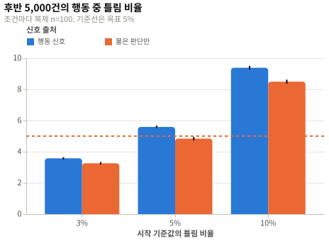
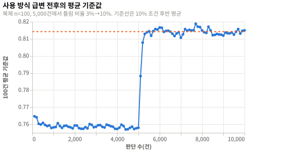

# 빠른 조정의 수렴과 진동: 실험 결과

## 요약

행동 신호 5% 조건의 후반 행동 중 틀림 비율은 5.6% [5.5, 5.7]이고, 100건 안 기준값 폭은 0.051 [0.050, 0.052]다(복제 n=100). 수렴(H1), 방향(H2), 급변 뒤 재조정(H4)은 채택하고 진동(H3)은 기각한다. 진동을 줄이는 방법은 [#140](https://github.com/woonyong-choi/saturn/issues/140)에서 정하도록 judge 학습 설계의 미해결 질문에 올렸다.

## 방법

| 항목 | 값 |
|---|---|
| 설계 | [실험 설계](design.md), 커밋 `4f2af18` |
| 실행 id | `20261001T105423Z-4f2af18` |
| 환경 | [env.json](env.json) |
| 표본 | 설계 조건 7개 × 복제 100개 × 판단 10,000건, 실제 조건 7개 × 복제 100개 × 판단 10,000건 |

## 설계와 다른 점

| 변경 | 시점 | 이유 | 결론에 미친 영향 |
|---|---|---|---|
| p값을 `erfc`로 계산하고 유효 숫자 여섯 자리로 저장했다 | 분석 중 | 소수점 여섯 자리 반올림으로 작은 p값이 0으로 기록됐다 | 없음. 판정은 같다 |
| 재시작 유무별 100건 안 기준값 폭과 판단당 신호 수를 탐색 지표로 더했다 | 분석 중 | H3 기각의 원인을 보려고 했다 | 없음. 판정에 쓰지 않았다 |
| 그림 원본의 축과 막대 배치를 고쳤다 | 분석 중 | 기준선이 x축 범주로 그려졌다 | 없음 |

## 결과

### 흐름

| 단계 | 수 |
|---|---|
| 수집 | 복제 700개 |
| 제외: 후반 5,000건에 행동한 판단 없음 | 0 |
| 실패한 실행 | 0 |
| 분석 | 복제 700개 |

### 확인 분석

| 가설 | 지표 | 값 | 95% 신뢰구간 | n | 판정 |
|---|---|---|---|---|---|
| H1 | 행동 신호 5%, 후반 행동 중 틀림 비율 | 5.6% | [5.5, 5.7] | 100 | 채택 |
| H2 | 행동 신호 3%, 후반 행동 중 틀림 비율 | 3.6% | [3.5, 3.6] | 100 | 채택 |
| H2 | 행동 신호 10%, 후반 행동 중 틀림 비율 | 9.4% | [9.3, 9.5] | 100 | 채택 |
| H3 | 행동 신호 3%, 100건 안 기준값 폭 | 0.030 | [0.029, 0.032] | 100 | 기각 |
| H3 | 행동 신호 5%, 100건 안 기준값 폭 | 0.051 | [0.050, 0.052] | 100 | 기각 |
| H3 | 행동 신호 10%, 100건 안 기준값 폭 | 0.053 | [0.052, 0.054] | 100 | 기각 |
| H4 | 급변 뒤 2,500건 안 재조정 비율 | 100/100, 100.0% | [96.3, 100.0] | 100 | 채택 |

- Holm 보정 p값은 H1 p = 7.86e-22, H2 3% p = 2.99e-57, H2 10% p = 1.49e-24, H4 p = 1.15e-6이었다. H3 세 조건은 p = 1.0이었다.
- 복제 사이 표준편차는 H1 0.42%p, H3 0.0048~0.0081이었다.
- 복제를 합친 행동 중 틀림 비율은 5% 조건 12,819/229,514, 5.6% [5.5, 5.7]이었다.
- 급변 조건은 5,000건 뒤 중앙값 300건, p95 700건 만에 목표 기준값 0.814 ±0.01에 들었다.






### 탐색 분석

- 물은 판단만 신호로 쓴 조건의 후반 행동 중 틀림 비율은 3.3%, 4.8%, 8.5%였다.
- 물은 판단만 조건의 100건 안 기준값 폭은 0.004, 0.005, 0.005로 멈춤 폭 0.02보다 작았다.
- 판단 100건당 신호는 행동 신호 조건에서 29.3~32.4건, 물은 판단만 조건에서 1.3~1.4건이었다.
- 1만 건 동안 급변 재시작은 행동 신호 세 조건 평균 12.7~23.7번, 물은 판단만 조건 0.7~2.0번이었다.
- 행동 신호 세 조건에서 재시작이 있던 100건 묶음의 폭은 0.075~0.098, 없던 묶음은 0.021~0.046이었다.
- 마지막 판단에서 멈춤 상태인 복제는 행동 신호 3% 조건 25/100, 나머지 조건은 1/100 이하였다.
- 후반 평균 기준값은 행동 신호 조건에서 0.758, 0.773, 0.814였다.
- 합성 분포에서 행동 중 틀림 비율이 5%가 되는 기준값은 0.643, 0.800, 0.908이었다.
- 틀림·놓침 가중합의 균형 기준값은 행동 신호에서 0.694, 0.756, 0.825, 물은 판단만에서 0.764, 0.818, 0.875였다.
- 후반에 사용자에게 물은 비율은 판단당 3.3~3.7%로 상한 5% 안이었다.

## 논의

### 해석

빠른 조정은 기준값을 목표 틀림 비율 쪽으로 옮기고, 사용 방식이 바뀌면 수백 건 안에 다시 맞춘다. 행동 신호를 모두 쓰면 q가 0.01일 때 가중이 100이라 신호 하나가 기준값을 ±0.05 범위 끝까지 옮기고, 우연한 틀림 연속이 급변 재시작을 자주 일으켜 폭이 줄지 않는다. 멈추는 점은 틀림·놓침 가중합의 균형점이라 행동 중 틀림 비율이 정확히 α가 되지 않고, 10% 조건은 범위를 남긴 채 9.4%에 머문다. 큰 이동을 느린 조정이 맡는 설계와는 맞고, 진동 규칙은 [#140](https://github.com/woonyong-choi/saturn/issues/140)에서 다시 정한다.

### 타당성 위협

| 종류 | 위협 | 이 실험에서 |
|---|---|---|
| 내적 | 파이썬 이식이 `calibration.rs`와 다르게 동작할 수 있다. | 수집 전 단위 테스트와 같은 성질 다섯 가지를 확인했고 모두 통과했다. Rust 코드와 같은 입력으로 결과를 맞춰 보지는 않았다. |
| 내적 | 같은 복제 안 판단이 독립이 아니라 판단 단위 신뢰구간이 지나치게 좁다. | 판정은 복제 단위 평균으로 했다. 합친 k/n의 Wilson 구간은 보고만 했다. |
| 구성 | 실제 사용자는 틀린 행동을 모두 뒤집지 않고 놓친 행동을 모두 직접 하지 않는다. | 두 극단의 폭이 0.004~0.005와 0.030~0.053으로 크게 갈렸다. 실제 감지 비율은 이 사이에 있다. |
| 구성 | 신호를 판단 바로 뒤 확정해 관찰 시간의 지연을 빠뜨린다. | 지연을 넣지 않았다. 지연이 있으면 같은 기준값으로 여러 판단이 쌓여 폭이 달라질 수 있다. |
| 외적 | 합성 분포 하나와 질문 하나만 쓴다. | 결론은 이 분포와 중심값 0.8에 한정된다. |
| 외적 | 느린 조정과 순차 검정 되돌리기를 함께 돌리지 않는다. | 빠른 조정만 돌렸다. |

### 한계

- 사용자가 틀림과 놓침을 알아채는 비율을 두 극단으로만 나눴다.
- 묻기 상한의 최근 비율을 복제 시작부터의 누적으로 계산했다.
- 진동을 줄이는 선택지(가중 상한, 폭 상수, 급변 판정)는 이 실험에서 시험하지 않았다.

## 재현

```sh
./run.sh verify
./run.sh analyze
```

| 파일 | SHA-256 |
|---|---|
| `data/SHA256SUMS` | `3b94616cd738a57cf690bd91523383f9b9d3bf4c13a40bba42eec2b54066377e` |

## 결론

| 가설 | 판정 | 반영한 문서 |
|---|---|---|
| H1 | 채택 | [judge 학습](../../design/router-training.md) |
| H2 | 채택 | [judge 학습](../../design/router-training.md) |
| H3 | 기각 | [judge 학습](../../design/router-training.md) |
| H4 | 채택 | [judge 학습](../../design/router-training.md) |
