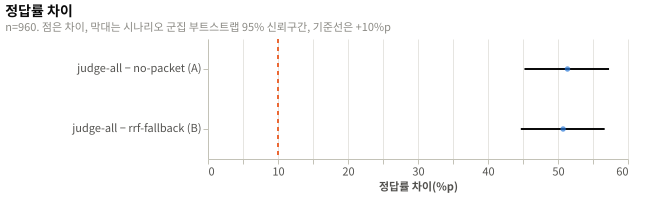

# 새 패킷 규칙의 전환 품질 재측정: 실험 결과

## 요약

`judge-all`의 정답률은 71.4%이고 `no-packet`보다 51.4%p 높으며, 시나리오 군집 부트스트랩 95% 신뢰구간은 [45.2, 57.3], 시행은 960개다. `rrf-fallback`과의 차이는 +50.7%p [44.7, 56.7]다. H1은 하한이 +10%p 이상이라 채택이고, H2는 하한이 +10%p를 넘어 기각이다. 패킷 설계를 유지하고 두 설계 문서의 요구사항 표와 단점에 이 보고서를 링크했으며, 판단 없는 패킷의 규칙을 정하는 `design` 이슈 [#222](https://github.com/woonyong-choi/saturn/issues/222)를 열었다.

## 방법

| 항목 | 값 |
|---|---|
| 설계 | [실험 설계](design.md), 커밋 `aa1e13a` |
| 실행 id | `20261001T185207Z-aa1e13a` |
| 환경 | [env.json](env.json) |
| 표본 | 설계 시나리오 48, 시행 조건마다 960. 실제 시나리오 48, 시행 조건마다 960 |

## 설계와 다른 점

| 변경 | 시점 | 이유 | 결론에 미친 영향 |
|---|---|---|---|
| Codex 사용률을 읽기 전에 짧은 Codex 세션 하나를 남겼다. | 수집 중 | `--ephemeral` 세션은 `~/.codex/sessions`에 기록을 남기지 않아 사용률이 갱신되지 않는다. 사용량 확인 때마다 기록 하나를 만들어 값을 갱신했다. | 없음. 답 수집 세션이 아니다. |
| `01-collect`의 judge 요청 오류 처리에 `OSError`를 더했다. | 수집 중 | 시나리오 45번째의 judge 요청 중 연결이 끊겨(`ConnectionResetError`) 처리하지 못한 예외로 수집이 멈췄다. 연결 오류를 다른 오류처럼 재시도하고 실패로 세도록 고쳤고 같은 실행 id로 이어 받았다. 그 시나리오의 judge 판단은 처음부터 다시 받았다. | 없음. 판단 기록의 judge 실패는 0개지만 끊긴 요청 1개는 집계에 남지 않았다. |
| `02-process`에 질문 하위 유형 열을, `03-analyze`에 하위 유형별 정답률과 질문 유형별 근거 포함률을 더했다. | 분석 중 | 날짜 질문과 `multi-session` 질문의 결과를 탐색 분석에서 가르기 위해서다. | 없음. 판정 지표는 바꾸지 않았다. |

## 결과

### 흐름

| 단계 | 수 |
|---|---|
| 수집(세션) | 288 |
| 제외: provider 도구 호출 | 0 |
| 제외: 답 JSON을 읽을 수 없음 | 0 |
| 제외: 종료 코드 실패나 300초 초과 | 0 |
| 분석(시나리오 × provider × 질문) | 960, 시나리오 48 |

- 세션 288개가 모두 한 번에 정상 종료했다.
- `judge-all` 패킷을 만든 judge 요청은 시나리오마다 6개였고, 기록된 판단의 실패는 0개였다. 45번째 시나리오에서 연결이 끊긴 요청 1개는 판단 재수집으로 대체되어 집계에 없으며, 그 실패는 원자료에도 남지 않았다.
- 시험 5개 뒤 Claude 주간 사용률은 27%에서 27%, Codex 주간 사용률은 10%에서 10%였다. 비용으로 환산한 외삽 추정(데이터 설명에 있다)이 한도 4%p 안이라 수집을 이어 갔다. 수집이 끝났을 때 Claude 주간 사용률은 28%, Codex 주간 사용률은 11%였다.

### 확인 분석

| 가설 | 지표 | 값 | 95% 신뢰구간 | n | 판정 |
|---|---|---|---|---|---|
| H1 | `diff_a`: `judge-all` − `no-packet` | +51.4%p | [45.2, 57.3] | 960 | 채택 |
| H2 | `diff_b`: `judge-all` − `rrf-fallback` | +50.7%p | [44.7, 56.7] | 960 | 기각 |

- H1은 하한 45.2%p가 +10%p 이상이다. 기준 +10%p에 대한 Holm 보정 p는 0.0004다.
- H2는 하한 44.7%p가 +10%p를 넘는다. Holm 보정 p는 0.0004다.

| 조건 | k/n | 정답률 | 95% Wilson 신뢰구간 |
|---|---|---|---|
| `judge-all` | 685/960 | 71.4% | [68.4, 74.1] |
| `rrf-fallback` | 198/960 | 20.6% | [18.2, 23.3] |
| `no-packet` | 192/960 | 20.0% | [17.6, 22.6] |



### 탐색 분석

이 절의 값은 판정에 쓰지 않았다. 보조 검정은 시행을 독립으로 보므로 군집을 반영한 신뢰구간보다 좁다. H1 쌍에서 McNemar 불일치는 b = 493, c = 0, p = 3.17e-109이고 Newcombe 신뢰구간은 [48.1, 54.4]였다. H2 쌍에서는 b = 487, c = 0, p = 6.41e-108이고 Newcombe 신뢰구간은 [47.5, 53.8]였다.

| 질문 유형 | `judge-all` | `rrf-fallback` | `no-packet` |
|---|---|---|---|
| `extract` | 141/192 (73.4%) | 0/192 (0.0%) | 0/192 (0.0%) |
| `multi-session` | 150/192 (78.1%) | 0/192 (0.0%) | 0/192 (0.0%) |
| `temporal` | 81/192 (42.2%) | 0/192 (0.0%) | 0/192 (0.0%) |
| `update` | 121/192 (63.0%) | 6/192 (3.1%) | 0/192 (0.0%) |
| `abstain` | 192/192 (100.0%) | 192/192 (100.0%) | 192/192 (100.0%) |

- `multi-session`과 `temporal`은 이전 실험에서 세 조건 모두 0.0%였다. 이번에 `judge-all`은 78.1%와 42.2%였다. 질문별로는 오류 코드 두 개 75/96, 날짜 합 75/96, 날짜 46/96, 먼저 한 것 35/96이었다(`judge-all`, 나머지 두 조건은 모두 0/96).
- provider별 `judge-all` 정답률은 Claude Code Opus 5.5가 339/480(70.6%), Codex GPT-6 Sol이 346/480(72.1%)였다. 두 provider 모두 `rrf-fallback` 99/480(20.6%), `no-packet` 96/480(20.0%)이었다. `diff_a`는 Claude Code 50.6%p, Codex 52.1%p였다.
- 근거 항목이 패킷에 든 비율은 `judge-all` 474/624(76.0%, [72.5, 79.1]), `rrf-fallback` 30/624(4.8%, [3.4, 6.8])였다. 관계별로는 `judge-all`이 같은 낱말 210/277(75.8%), 번역어 129/178(72.5%), 같은 뜻의 다른 말 135/169(79.9%)였고, `rrf-fallback`은 30/277(10.8%), 0/178(0.0%), 0/169(0.0%)였다. 질문 유형별 `judge-all` 근거 포함률은 `extract` 78.1%, `multi-session` 91.7%, `temporal` 66.7%, `update` 66.1%였다.
- 근거 항목의 관계 비율은 같은 낱말 277개, 번역어 178개, 같은 뜻의 다른 말 169개였다.
- 패킷의 평균 크기는 `judge-all` 7,995.5토큰(포함 항목 19.1개), `rrf-fallback` 7,995.9토큰(포함 항목 20.2개), `no-packet` 5.2토큰이었다. judge는 시나리오마다 후보 128개를 판단했다.
- 이전 실험 대비 `judge-all`은 28.4%에서 71.4%(+42.9%p)로 올랐고, `rrf-fallback`은 21.5%에서 20.6%(−0.8%p), `no-packet`은 20.0%로 같았다. 질문 유형별 `judge-all`의 변화는 `extract` +47.4%p, `multi-session` +78.1%p, `temporal` +42.2%p, `update` +46.9%p였다. 시나리오와 패킷 규칙이 둘 다 달라 기술 통계로만 본다.

## 논의

### 해석

기준값 없이 확률 순으로 채우고 session과 시각을 표기한 `judge-all` 패킷은 패킷 없음보다 정답률을 51.4%p 올려 패킷 설계를 유지할 근거가 된다. 이득은 이전에 0.0%였던 `multi-session`과 `temporal`을 포함해 모든 유형에서 났고, 날짜 질문(46/96)과 먼저 한 것 질문(35/96)이 아직 낮다. 반면 순위 순서로 채운 패킷은 정답률이 패킷 없음과 같은 20.6%여서 judge가 실패했을 때 순위로 채우는 대체 규칙은 전환 품질을 지키지 못한다. 기록된 판단에 judge 실패가 없었고 연결 끊김 1회는 집계되지 않았으므로 이 값은 판단 순서의 차이이고 실패 빈도는 알 수 없다.

### 타당성 위협

| 종류 | 위협 | 이 실험에서 |
|---|---|---|
| 내적 | 한 세션에서 질문 10개를 함께 물어 시행이 독립이 아니다. | 시나리오 48개 단위 군집 부트스트랩으로 판정했다. McNemar는 독립을 가정해 보조로만 썼다. |
| 내적 | provider와 judge의 샘플링이 고정되지 않는다. | 한 시나리오의 세 조건을 같은 시간대에 무작위 순서로 실행했다. 세션을 다시 실행하지 않았다. |
| 내적 | 시나리오마다 judge 호출이 한 번이라 판단 오차가 두 provider에 같이 실린다. | 두 provider의 차이가 비슷했다(`diff_a` Claude 50.6%p, Codex 52.1%p). 오차는 시나리오 군집에 반영됐다. |
| 구성 | 질문 정답률은 전환 품질의 일부만 잰다. | 유형별로 보면 모든 유형에서 `judge-all`이 올랐다. 이어 할 작업의 수행은 재지 못했다. |
| 구성 | 문자열 포함 채점은 맞는 답을 다른 표기로 쓰면 틀림으로 센다. | 답 JSON을 읽을 수 없는 세션은 0개였다. 표기 차이로 틀림이 된 답의 수는 세지 않았다. |
| 구성 | 패킷이 항상 예산까지 차서 두 패킷 조건의 입력 토큰이 같다. | 두 조건의 평균 패킷이 7,995.5토큰과 7,995.9토큰이었다. 비용 차이는 이 실험에서 보이지 않았다. |
| 구성 | `abstain` 질문 2개는 패킷이 없어도 맞힐 수 있다. | `abstain`은 세 조건 모두 100.0%였고 `no-packet`의 20.0%는 이 유형만으로 나왔다. |
| 외적 | 합성 기록은 도구 결과 대부분이 반복 로그라 실제 기록과 다르다. | 결과는 합성 시나리오에만 적용한다. 실제 기록에서의 값은 재지 않았다. |
| 외적 | 한 가상 서비스와 두 provider의 한 버전에서만 쟀다. | 버전을 `env.json`에 남겼다. 다른 모델과 버전으로는 재지 않았다. |

### 한계

- 근거 항목이 패킷에 든 비율은 항목이 축약본으로 들어간 경우 근거 줄이 잘렸는지 가르지 못한다.
- judge가 후보 128개를 판단할 때 결과를 앞 4,000자까지만 봤고 질문 문구는 한 가지만 썼다.
- 기록된 판단에는 judge 실패가 없었다(연결이 끊긴 요청 1개는 재수집으로 대체). 비교 B는 judge가 판단한 순서와 순위 순서의 차이를 잰 값이며, 실패한 요청이 섞인 패킷은 측정하지 않았다.
- 패킷이 항상 예산까지 차므로 새 session의 입력 토큰 증가와 정답률 향상의 비용 대비는 재지 않았다.
- 사용률은 정수 퍼센트로만 읽혀 증가량의 오차가 크고 같은 계정의 다른 작업이 섞인다.

## 재현

```sh
./run.sh verify
./run.sh analyze
```

| 파일 | SHA-256 |
|---|---|
| `data/SHA256SUMS` | `8020073760ce5979ed1fde5f2af6a0ada36d68e8accebee01f0511ebeb88c1de` |

## 결론

| 가설 | 판정 | 반영한 문서 |
|---|---|---|
| H1 | 채택 | [맥락 정리](../../design/context-management.md) |
| H2 | 기각 | [맥락 고르기](../../design/context-selection.md) |
