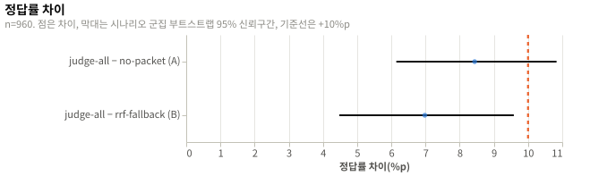

# Jev 전체 판단 패킷의 전환 품질과 대체 경로: 실험 결과

## 요약

`judge-all`의 정답률은 28.4%이고 `no-packet`보다 8.4%p 높으며, 시나리오 군집 부트스트랩 95% 신뢰구간은 [6.1, 10.8], 시행은 960개다. `rrf-fallback`과의 차이는 7.0%p [4.5, 9.6]다. 두 신뢰구간이 사전 등록한 판정 조건을 모두 채우지 못해 H1과 H2는 보류다. 판정이 보류라 설계는 바꾸지 않고 두 설계 문서의 요구사항 표에 이 보고서를 링크했다.

## 방법

| 항목 | 값 |
|---|---|
| 설계 | [실험 설계](design.md), 커밋 `7286bba` |
| 실행 id | `20261001T172434Z-7286bba` |
| 환경 | [env.json](env.json) |
| 표본 | 설계 시나리오 48, 시행 조건마다 960. 실제 시나리오 48, 시행 조건마다 960 |

## 설계와 다른 점

| 변경 | 시점 | 이유 | 결론에 미친 영향 |
|---|---|---|---|
| Codex 사용률을 읽기 전에 짧은 Codex 세션 하나를 남겼다. | 수집 중 | `--ephemeral` 세션은 `~/.codex/sessions`에 기록을 남기지 않아 사용률이 갱신되지 않는다. 사용량 확인 때마다 기록 하나를 만들어 값을 갱신했다. | 없음. 답 수집 세션이 아니다. |
| 시험 수집의 사용률 증가를 외삽하면 5%p를 넘었지만 수집을 계속했다. | 수집 중 | 시험 5개에서 Claude 주간 사용률이 24%에서 25%로 1%p 올랐고 단순 외삽은 9.6%p였다. 사용률은 정수라 오차가 크고 같은 계정을 다른 작업도 쓴다. 시험 세션 15개의 입력이 작아 본 수집의 증가는 5%p보다 훨씬 작다고 판단했고, 시나리오 6개마다 5%p 한도를 다시 확인했다. | 없음. 한도에 닿지 않았다. |
| `03-analyze`의 그림 코드와 사용률 요약을 수집 뒤에 고쳤다. | 분석 중 | 그림을 `errorbar`와 `rule`로 그리고 사용률 값을 `summary.json`에 넣기 위해서다. 통계 계산은 바꾸지 않았다. | 없음 |

## 결과

### 흐름

| 단계 | 수 |
|---|---|
| 수집(세션) | 288 |
| 제외: provider 도구 호출 | 0 |
| 제외: 답 JSON을 읽을 수 없음 | 0 |
| 제외: 종료 코드 실패나 300초 초과 | 0 |
| 분석(시나리오 × provider × 질문) | 960, 시나리오 48 |

- 세션 288개가 모두 한 번에 정상 종료했다.
- `judge-all` 패킷을 만든 judge 요청은 시나리오마다 6개였고 실패는 0개였다.

### 확인 분석

| 가설 | 지표 | 값 | 95% 신뢰구간 | n | 판정 |
|---|---|---|---|---|---|
| H1 | `diff_a`: `judge-all` − `no-packet` | +8.4%p | [6.1, 10.8] | 960 | 보류 |
| H2 | `diff_b`: `judge-all` − `rrf-fallback` | +7.0%p | [4.5, 9.6] | 960 | 보류 |

- H1은 하한 6.1%p가 +10%p에 못 미치고 상한 10.8%p가 +10%p를 넘어 채택도 기각도 아니다. 기준 +10%p에 대한 Holm 보정 p는 0.212다.
- H2는 상한 9.6%p가 +10%p 이하지만 Holm 보정 p가 0.051로 0.05를 넘어 채택 기준을 채우지 못했다. 보정 전 p는 0.025다.

| 조건 | k/n | 정답률 | 95% Wilson 신뢰구간 |
|---|---|---|---|
| `judge-all` | 273/960 | 28.4% | [25.7, 31.4] |
| `rrf-fallback` | 206/960 | 21.5% | [19.0, 24.2] |
| `no-packet` | 192/960 | 20.0% | [17.6, 22.6] |



### 탐색 분석

이 절의 값은 판정에 쓰지 않았다. 보조 검정은 시행을 독립으로 보므로 군집을 반영한 신뢰구간보다 좁다. H1 쌍에서 McNemar 불일치는 b = 81, c = 0, p = 2.26e-19이고 Newcombe 신뢰구간은 [6.7, 10.2]였다. H2 쌍에서는 b = 81, c = 14, p = 6.24e-12이고 Newcombe 신뢰구간은 [5.0, 8.9]였다.

| 질문 유형 | `judge-all` | `rrf-fallback` | `no-packet` |
|---|---|---|---|
| `extract` | 50/192 (26.0%) | 0/192 (0.0%) | 0/192 (0.0%) |
| `multi-session` | 0/192 (0.0%) | 0/192 (0.0%) | 0/192 (0.0%) |
| `temporal` | 0/192 (0.0%) | 0/192 (0.0%) | 0/192 (0.0%) |
| `update` | 31/192 (16.1%) | 14/192 (7.3%) | 0/192 (0.0%) |
| `abstain` | 192/192 (100.0%) | 192/192 (100.0%) | 192/192 (100.0%) |

- provider별 `judge-all` 정답률은 Claude Code Opus 5.5가 137/480(28.5%), Codex GPT-6 Sol이 136/480(28.3%)였다. 두 provider 모두 `rrf-fallback` 103/480(21.5%), `no-packet` 96/480(20.0%)이었다.
- 근거 항목이 패킷에 든 비율은 `judge-all` 75/624(12.0%, [9.7, 14.8]), `rrf-fallback` 66/624(10.6%, [8.4, 13.2])였다. 관계별로는 `judge-all`이 같은 낱말 43/272(15.8%), 번역어 20/175(11.4%), 같은 뜻의 다른 말 12/177(6.8%)였고, `rrf-fallback`은 65/272(23.9%), 0/175(0.0%), 1/177(0.6%)였다.
- 근거 항목의 관계 비율은 같은 낱말 272개, 번역어 175개, 같은 뜻의 다른 말 177개였다.
- 패킷의 평균 크기는 `judge-all` 865.1토큰(포함 항목 1.6개), `rrf-fallback` 7,998.5토큰(포함 항목 24.2개), `no-packet` 5.2토큰이었다. judge는 시나리오마다 후보 128개를 판단했다.

## 논의

### 해석

`judge-all` 패킷은 패킷 없음보다 정답률을 8.4%p 올렸지만 그 폭이 기준 10%p를 신뢰구간 안에 둬 패킷 설계를 유지하거나 재설계할 근거가 되지 못한다. 순위 대체 패킷과의 차이 7.0%p는 상한이 10%p 아래이지만 Holm 보정 p가 0.051이라 대체 규칙 유지도 확정하지 못한다. 이득은 `extract`와 `update`에서만 났고 `multi-session`과 `temporal`은 세 조건 모두 0.0%였다. `judge-all` 패킷은 평균 1.6개 항목만 담아 후보를 기준값 0.5로 대부분 버렸고, 이것이 이득이 작은 이유의 후보다.

### 타당성 위협

| 종류 | 위협 | 이 실험에서 |
|---|---|---|
| 내적 | 한 세션에서 질문 10개를 함께 물어 시행이 독립이 아니다. | 시나리오 48개 단위 군집 부트스트랩으로 판정했다. McNemar는 독립을 가정해 보조로만 썼다. |
| 내적 | provider와 judge의 샘플링이 고정되지 않는다. | 한 시나리오의 세 조건을 같은 시간대에 무작위 순서로 실행했다. 세션을 다시 실행하지 않았다. |
| 내적 | 시나리오마다 judge 호출이 한 번이라 판단 오차가 두 provider에 같이 실린다. | 두 provider의 차이가 비슷했다(`diff_a` Claude 8.5%p, Codex 8.3%p). 오차는 시나리오 군집에 반영됐다. |
| 구성 | 질문 정답률은 전환 품질의 일부만 잰다. | 유형별로 보면 사실 추출과 갱신에서만 차이가 났다. 이어 할 작업의 수행은 재지 못했다. |
| 구성 | 문자열 포함 채점은 맞는 답을 다른 표기로 쓰면 틀림으로 센다. | 답 JSON을 읽을 수 없는 세션은 0개였다. 표기 차이로 틀림이 된 답의 수는 세지 않았다. |
| 구성 | `abstain` 질문 2개는 패킷이 없어도 맞힐 수 있다. | `abstain`은 세 조건 모두 100.0%였고 `no-packet`의 20.0%는 이 유형만으로 나왔다. 나머지 유형의 `no-packet` 정답률은 0.0%였다. |
| 외적 | 합성 기록은 도구 결과 대부분이 반복 로그라 실제 기록과 다르다. | 결과는 합성 시나리오에만 적용한다. 실제 기록에서의 값은 재지 않았다. |
| 외적 | 한 가상 서비스와 두 provider의 한 버전에서만 쟀다. | 버전을 `env.json`에 남겼다. 다른 모델과 버전으로는 재지 않았다. |

### 한계

- 근거 항목이 패킷에 든 비율은 항목이 축약본으로 들어간 경우 근거 줄이 잘렸는지 가르지 못한다.
- judge가 후보 128개를 판단할 때 결과를 앞 4,000자까지만 봤고 질문 문구와 기준값 0.5는 한 가지만 썼다. 다른 문구와 기준값에서의 `judge-all` 패킷 크기는 재지 않았다.
- 실제 judge 실패는 한 번도 나오지 않았다. 비교 B는 judge가 판단한 순서와 순위 순서의 차이를 잰 값이며, 실패한 요청이 섞인 패킷은 측정하지 않았다.
- 사용률은 정수 퍼센트로만 읽혀 증가량의 오차가 크고 같은 계정의 다른 작업이 섞인다.

## 재현

```sh
./run.sh verify
./run.sh analyze
```

| 파일 | SHA-256 |
|---|---|
| `data/SHA256SUMS` | `9bc656b804cde8e9fb371f63e5fd296aef4dff4f8c3fefa3edbf2cc6e5a739da` |

## 결론

| 가설 | 판정 | 반영한 문서 |
|---|---|---|
| H1 | 보류 | [맥락 정리](../../design/context-management.md) |
| H2 | 보류 | [맥락 고르기](../../design/context-selection.md) |
