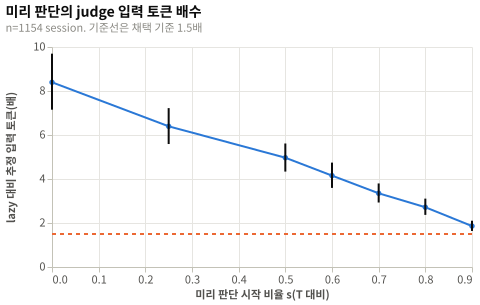
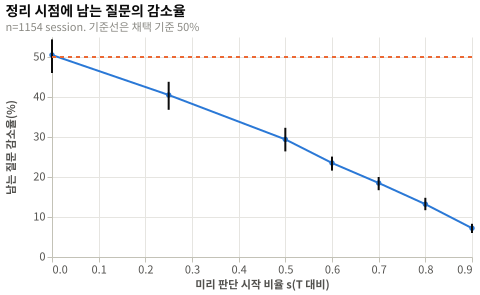

# 도구 결과 미리 판단의 손익분기: 실험 결과

## 요약

활성 맥락이 `T`의 50%를 넘은 뒤부터 미리 판단하면 정리 시점에 남는 질문은 29.4% [26.4, 32.3] 줄고, judge 추정 입력 토큰은 4.967배 [4.337, 5.614]로 는다(n=1154 session). H1은 채택, H2와 H3은 기각이고, 토큰 배수 상한이 1.5 이하인 시작 비율은 없다. [맥락 정리](../../design/context-management.md)에 `compact` 판단은 패킷을 만들 때 한 번만 한다고 정했다. 후보 전체를 묻는 조건으로 다시 계산한 결과는 [후속 분석](#후속-분석-후보-전체-판단-조건)에 있고, 사전 등록 판정은 바꾸지 않았다.

## 방법

| 항목 | 값 |
|---|---|
| 설계 | [실험 설계](design.md), 커밋 `0069654` |
| 실행 id | `20261001T105302Z-0069654` |
| 환경 | [env.json](env.json) |
| 표본 | 설계 전수, 실제 1154 session |

## 설계와 다른 점

| 변경 | 시점 | 이유 | 결론에 미친 영향 |
|---|---|---|---|
| `03-analyze.py`가 수집 흐름의 합계를 `summary.json`에 더했다. | 분석 중 | 흐름 표의 수를 `summary.json`에서만 옮기기 위해서다. | 없음. 판정에 쓰는 계산은 바뀌지 않았다. |
| `03-analyze.py`가 session 비율의 Wilson 신뢰구간을 `summary.json`에 더했다. | 분석 중 | 탐색 분석의 비율을 통계 규칙대로 보고하기 위해서다. | 없음. 탐색 분석에만 쓰였다. |

## 결과

### 흐름

| 단계 | 수 |
|---|---|
| 수집: 읽은 기록 파일 | 2081 |
| 제외: subagent 기록 파일 | 848 |
| 제외: 턴 없음 | 11 |
| 제외: 맥락 토큰 없음 | 67 |
| 제외: 중복 session | 1 |
| 실패: 읽지 못한 파일 | 0 |
| 실패: 해석하지 못한 줄 | 0 |
| 분석 | 1154 |

분석한 1154 session은 Claude Code 658개, Codex 496개였다. 턴은 11330개, 도구 호출은 204103개였다. `T`=100,000토큰에서 정리 사건은 1572번 일어났다.

### 확인 분석

| 가설 | 지표 | 값 | 95% 신뢰구간 | n | 판정 |
|---|---|---|---|---|---|
| H1 | `q_ratio(0)` | 9.091배 | [7.76, 10.524] | 1154 | 채택 |
| H2 | `pending_cut(0.5)` | 29.4% | [26.4, 32.3] | 1154 | 기각 |
| H3 | `tok_ratio(0.5)` | 4.967배 | [4.337, 5.614] | 1154 | 기각 |

- 단측 bootstrap p값은 H1이 p = 0(10,000회 중 0회), H2와 H3이 p = 1이었다. Holm-Bonferroni 뒤에도 판정은 같았다.
- 모든 시작 비율에서 judge 질문 수와 추정 입력 토큰은 `lazy`보다 컸다. 가장 늦은 `s`=0.9에서도 토큰은 1.86배 [1.639, 2.104]였다.
- 남는 질문 감소율은 `s`=0에서 50.5% [46.0, 54.4]로 가장 컸고, `s`=0.9에서 7.2% [6.0, 8.3]였다.

| 조건 | 질문 수 배수 | 토큰 배수 [95% 신뢰구간] | 남는 질문 감소율 [95% 신뢰구간] |
|---|---|---|---|
| `pre@0` | 9.091 | 8.395 [7.151, 9.697] | 50.5% [46.0, 54.4] |
| `pre@0.25` | 6.926 | 6.394 [5.59, 7.222] | 40.5% [36.8, 43.8] |
| `pre@0.5` | 5.305 | 4.967 [4.337, 5.614] | 29.4% [26.4, 32.3] |
| `pre@0.6` | 4.428 | 4.153 [3.596, 4.745] | 23.5% [21.6, 25.1] |
| `pre@0.7` | 3.544 | 3.35 [2.931, 3.798] | 18.5% [16.7, 20.0] |
| `pre@0.8` | 2.833 | 2.716 [2.369, 3.108] | 13.2% [11.7, 14.8] |
| `pre@0.9` | 1.954 | 1.86 [1.639, 2.104] | 7.2% [6.0, 8.3] |





### 탐색 분석

- 정리 사건에 닿은 session은 507/1154, 43.9% [41.1, 46.8]였다. Claude Code는 30.2% [26.9, 33.9], Codex는 62.1% [57.7, 66.3]였다.
- provider 압축이 실제로 일어난 session은 187/1154, 16.2% [14.2, 18.4]였다. Claude Code는 0.5% [0.2, 1.3], Codex는 37.1% [33.0, 41.4]였다.
- session당 턴 수는 중앙값 1.0, p95 45.35였다. 턴당 도구 호출 수는 평균 18.014, 중앙값 5.0, p95 72.55였다.
- `pre@0`에서 미리 판단한 질문의 14.0%는 정리 사건에 닿지 않아 버려졌다. Claude Code만 보면 55.8%였다.
- `T`를 60,000토큰으로 낮추면 `s`=0.9의 토큰 배수는 1.4배였지만 남는 질문 감소율은 4.2%였다.
- `T`를 150,000토큰으로 올리면 `s`=0의 감소율은 62.2%였지만 토큰 배수는 13.828배였다.
- 호출 하나의 토큰 상한을 75나 4,000으로 바꿔도 `s`=0.5의 토큰 배수는 4.438배와 4.252배였다.
- 상위 N개가 미판단 호출부터 찬다는 상한 가정에서 `s`=0 감소율은 9.6%였다. 상위 N개가 가장 최근 호출이라는 가정에서도 9.6%였다.
- Codex만 보면 `s`=0의 감소율은 57.6%, 토큰 배수는 9.4배였다. Claude Code만 보면 16.7%와 3.445배였다.

## 논의

### 해석

미리 판단은 턴마다 그 턴의 호출을 모두 묻고, 정리 때 한 번 판단은 순위 상위 N개만 묻는다. 그래서 요청량 차이는 시작 비율과 무관하게 크다. 정리가 일어난 턴의 호출과 시작 전 호출이 순위에 들기 때문에 미리 판단해도 남는 질문은 절반 아래로 줄지 않는다. 정리 때 한 번 판단하는 요청은 이미 N개 호출, 20개 질문으로 묶여 있어 미리 판단으로 줄일 지연도 그 한 건의 몫이므로 패킷을 만들 때 한 번 판단하는 방식을 유지한다.

### 타당성 위협

| 종류 | 위협 | 이 실험에서 |
|---|---|---|
| 내적 | `A_t`가 캐시 계산 방식과 provider 압축 때문에 실제 활성 맥락과 다르다. | provider 압축이 Codex session의 37.1%에서 일어났다. 증가량만 이어 붙였으므로 압축 뒤 감소는 모의 맥락에 들어가지 않았다. |
| 내적 | 같은 session이 이어 쓰기로 두 파일에 나뉘어 중복으로 셀 수 있다. | 첫 입력 id로 중복 1개를 뺐다. 다른 id로 이어진 session은 잡지 못했다. |
| 구성 | 남는 질문 수는 전환 지연의 대리 지표이고, 실제 지연은 judge 응답 시간에 달렸다. | 남는 추정 토큰 감소율도 `s`=0.5에서 26.7% [23.7, 29.7]로 질문 수와 같은 방향이었다. |
| 구성 | 후보 순위를 모르므로 `pre@s`의 남는 질문 수는 고른 추출 가정의 기댓값이다. | 상한 가정과 최근성 가정에서는 감소율이 더 작아 판정이 미리 판단 쪽으로 바뀌지 않았다. |
| 구성 | 미리 한 판단은 그 턴의 목표 기준이라 정리 시점 목표와 어긋날 수 있다. | 재지 않았다. 어긋나면 미리 판단의 이득은 더 작다. |
| 외적 | 사용자 한 명의 Claude Code와 Codex 기록이며 Saturn 채팅이 아니다. | Claude Code session은 중앙값 1턴으로 짧았고, 긴 session은 대부분 Codex였다. |
| 외적 | 기록에 provider 전환이 없어 전환 사건을 셀 수 없다. | 정리 사건만으로 판정했다. 전환 사건도 요청 한 건에 N개 호출로 묶이므로 `lazy` 쪽 요청량은 사건 수에 비례해서만 는다. |

### 한계

- `T`는 아직 실측 전이라 100,000토큰으로 두었다([#7](https://github.com/woonyong-choi/saturn/issues/7)).
- 실행 중에 보낸 추가 입력은 턴으로 세지 않고 진행 중인 턴에 합쳤다.
- 판단 품질은 재지 않았다.

## 후속 분석: 후보 전체 판단 조건

이 절은 사전 등록하지 않은 분석이다. 위 판정(H1 채택, H2와 H3 기각)은 바꾸지 않고, 설계 판단의 근거로만 쓴다. 사전 등록 설계는 정리 때 순위 상위 N=10개만 묻는다고 가정했지만, 후보 전체를 judge에 묻기로 정했다([결정 기록](../../decisions/2026-10-01-judge-all-candidates.md)). 같은 원자료로 두 방식을 다시 계산했다.

### 후속 분석 방법

| 항목 | 값 |
|---|---|
| 스크립트 | `scripts/04-reanalyze-all-candidates.py` |
| 입력 | `data/processed/turns.csv`와 `results/summary.json`. 새 수집은 없다. |
| 출력 | `results/reanalysis-summary.json`, `results/tables/reanalysis-conditions.csv`, `results/figures/token-ratio-all-candidates.svg`, `results/figures/event-cut-all-candidates.svg` |
| 표본 | 위와 같은 1154 session, 정리 사건 1572번 |
| 신뢰구간 | session 단위 bootstrap 10,000회, 시드 119 |

시뮬레이션 규칙은 설계와 같고 다음만 달랐다.

1. 정리 사건의 `lazy` 요청은 직전 사건 뒤 도구 호출 전체를 묻는다. 상위 N개로 줄이지 않는다.
2. `pre@s`는 턴 끝마다 그 턴의 호출을 묻고, 사건에서는 아직 묻지 않은 호출만 묻는다.
3. 사건에 닿지 않은 마지막 구간에서 미리 한 질문은 버려지는 질문이다. 규칙 7의 기댓값 가정은 필요 없고 개수는 정확하다.
4. 요청은 본문 64,000바이트를 넘으면 나눠 보낸다. 토큰 하나를 4바이트로 보고, 조각마다 기본 토큰 500(state)을 더한다.
5. 전환 지연은 `조각 수 × 241ms`다. 241ms는 judge 평균 응답 시간이고([제약 식별과 대체 판정 정확도](../constraint-judge-accuracy/report.md)), 조각을 차례로 보낸다고 가정한 값이다.
6. 사건마다 대기 질문과 조각 수를 구하고, 묻지 않은 호출이 없는 사건은 0으로 평균에 넣는다.

### 후속 분석 결과

두 방식의 총량이다. `lazy`는 후보 전체를 한 번 묻는다.

| 조건 | 질문 수 | 질문 배수 [95% 신뢰구간] | 추정 입력 토큰 | 토큰 배수 [95% 신뢰구간] | 요청 수 | 버려지는 질문 비율 [95% 신뢰구간] |
|---|---|---|---|---|---|---|
| `lazy` | 368580 | 1 | 156960556 | 1 | 10552 | 해당 없음 |
| `pre@0.0` | 408206 | 1.108 [1.078, 1.15] | 175426974 | 1.118 [1.088, 1.161] | 15832 | 9.7% [7.3, 13.1] |
| `pre@0.25` | 398854 | 1.082 [1.06, 1.115] | 170902304 | 1.089 [1.067, 1.121] | 14679 | 7.6% [5.6, 10.3] |
| `pre@0.5` | 389034 | 1.055 [1.039, 1.081] | 166741543 | 1.062 [1.045, 1.087] | 13282 | 5.3% [3.7, 7.5] |
| `pre@0.6` | 382322 | 1.037 [1.027, 1.053] | 163735097 | 1.043 [1.032, 1.06] | 12598 | 3.6% [2.6, 5.0] |
| `pre@0.7` | 377758 | 1.025 [1.017, 1.036] | 161612610 | 1.03 [1.021, 1.042] | 12050 | 2.4% [1.7, 3.5] |
| `pre@0.8` | 374946 | 1.017 [1.011, 1.026] | 160245291 | 1.021 [1.014, 1.031] | 11602 | 1.7% [1.1, 2.5] |
| `pre@0.9` | 371090 | 1.007 [1.003, 1.012] | 158262478 | 1.008 [1.005, 1.014] | 11063 | 0.7% [0.3, 1.2] |

정리 사건 시점의 대기다.

| 조건 | 대기 질문 평균 | 대기 질문 감소율 [95% 신뢰구간] | 조각 수 평균 | 추정 지연 평균 | 추정 지연 p95 | 지연 감소율 [95% 신뢰구간] |
|---|---|---|---|---|---|---|
| `lazy` | 234.466 | 0% | 6.712 | 1617.705ms | 5061.0ms | 0% |
| `pre@0.0` | 89.411 | 61.9% [58.3, 64.5] | 2.951 | 711.195ms | 1928.0ms | 56.0% [51.6, 59.0] |
| `pre@0.25` | 128.328 | 45.3% [41.9, 48.5] | 3.971 | 957.101ms | 3133.0ms | 40.8% [37.5, 43.6] |
| `pre@0.5` | 156.382 | 33.3% [30.3, 36.4] | 4.68 | 1127.886ms | 3615.0ms | 30.3% [27.2, 33.1] |
| `pre@0.6` | 170.663 | 27.2% [24.9, 29.6] | 5.05 | 1216.958ms | 3856.0ms | 24.8% [22.2, 27.2] |
| `pre@0.7` | 186.252 | 20.6% [17.9, 23.5] | 5.447 | 1312.622ms | 4338.0ms | 18.9% [16.3, 21.6] |
| `pre@0.8` | 199.58 | 14.9% [12.4, 17.7] | 5.784 | 1394.029ms | 4338.0ms | 13.8% [11.4, 16.6] |
| `pre@0.9` | 215.752 | 8.0% [6.3, 9.9] | 6.235 | 1502.571ms | 4820.0ms | 7.1% [5.4, 9.0] |

- 후보 전체를 묻는 `lazy`의 질문은 368580개로, 상위 10개만 묻던 `lazy`의 31136개의 11.838배였다. 사건 하나의 대기 질문은 평균 19.807개에서 234.466개로 늘었다.
- 사건의 대기 질문은 중앙값 146개, p95 724개, 최댓값 8312개였다. 사건의 91.9%가 요청 한 건을 넘어 평균 6.712조각으로 나뉘었고, 추정 지연은 평균 1617.705ms, 최댓값 40970.0ms였다.
- 상위 10개 조건에서 `pre@0`의 질문 배수는 9.091배, 토큰 배수는 8.395배였다. 후보 전체 조건에서는 1.108배와 1.118배였다. `pre@0.5`의 토큰 배수는 4.967배에서 1.062배로 내려갔다.
- 미리 판단은 `lazy`가 사건에서 묻던 질문을 앞당긴다. 총 질문은 `lazy`보다 버려지는 질문(사건에 닿지 않은 구간의 질문)과 요청 수 증가분만큼 많다.
- 설계 H2와 H3의 기준(토큰 배수 신뢰구간 상한 1.5 이하, 대기 질문 감소율 신뢰구간 하한 50% 이상)을 설계 판단용 기준으로 가져오면, 충족한 시작 비율은 `s`=0 하나였다. `pre@0`은 토큰 1.118배 [1.088, 1.161], 감소율 61.9% [58.3, 64.5]였다. `pre@0.25`는 감소율 상한이 48.5%라 기준에 못 미쳤다.
- `pre@0`에 남는 대기 질문은 평균 89.411개, 조각 2.951개였고, 추정 지연은 평균 711.195ms, p95 1928.0ms였다. 사건의 63.4%는 여전히 한 건을 넘었고 최댓값은 37114.0ms였다.


### 후속 분석 해석

후보 전체를 묻는 조건에서는 미리 판단이 새 질문을 거의 만들지 않는다. 미리 한 질문은 사건에서 어차피 물을 질문이라, 추가 비용은 사건에 닿지 않아 버려지는 9.7%와 요청마다 붙는 기본 토큰뿐이다. 그래서 상위 10개 조건의 결론인 패킷 때 한 번 판단하는 방식이 근거를 잃는다. 시작을 늦출수록 비용은 1에 가까워지지만 앞당기는 질문도 같이 줄어, 대기 질문 감소율 50%를 넘는 시작은 첫 턴부터 판단하는 `s`=0뿐이다. 추정 지연 평균은 1617.705ms에서 711.195ms로 줄고 비용은 토큰 1.118배다.

### 후속 분석 한계

- 지연은 조각을 차례로 보낸다는 상한 가정이다. 조각을 동시에 보내면 조각 수와 무관하게 한 번의 응답 시간에 가까워지고, 그때는 `lazy`와 `pre@s`의 지연 차이가 줄어든다.
- 241ms는 질문 수가 적은 요청의 평균 응답 시간이다. 64,000바이트에 가까운 요청의 응답은 더 길 수 있다.
- 한 조각의 크기는 토큰 4바이트 환산과 기본 토큰 500으로 근사했다. 실제 state 크기는 재지 않았다.
- 미리 한 판단이 그 턴의 목표 기준이라 정리 시점 목표와 어긋나는 문제와 판단 품질은 재지 않았다([#117](https://github.com/woonyong-choi/saturn/issues/117)).
- 판정 기준 선택은 사후 결정이므로 적용 범위는 이 표본과 가정으로 한정한다.

## 재현

```sh
./run.sh verify
./run.sh analyze
```

`./run.sh analyze`는 후속 분석 스크립트도 실행한다.

| 파일 | SHA-256 |
|---|---|
| `data/SHA256SUMS` | `77c3aca1f6971934716790da65fc2a76159d4c93e3095976146ecd479badcfbd` |

## 결론

| 가설 | 판정 | 반영한 문서 |
|---|---|---|
| H1 | 채택 | [맥락 정리](../../design/context-management.md) |
| H2 | 기각 | [맥락 정리](../../design/context-management.md) |
| H3 | 기각 | [맥락 정리](../../design/context-management.md) |
