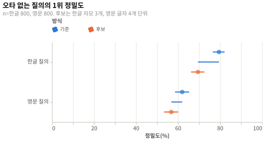

# 단어 조각 단위별 오타 재현율: 실험 결과

## 요약

한글 오타 질의에서 자모 3개 단위의 상위 10개 재현율은 94.5%로 기준 93.6%보다 0.9%p [−0.8, 2.6] 높았고(n=800), 오타 없는 질의의 1위 정밀도는 10.0%p [−12.5, −7.5] 낮았다. 영문 글자 4개 단위는 오타 재현율을 11.6%p [8.8, 14.5] 올렸지만 오타 없는 질의의 1위 정밀도를 5.2%p [−7.8, −2.7] 낮췄다. H1, H2, H4는 기각, H3은 채택이다. 단어 조각 규칙은 한글 글자 2개, 영문 식별자 단어를 유지하고 맥락 고르기 문서에 결과와 영문 띄어쓰기 누락 단점을 적었다.

## 방법

| 항목 | 값 |
|---|---|
| 설계 | [실험 설계](design.md), 커밋 `6235a29` |
| 실행 id | `20261001T105556Z-6235a29` |
| 환경 | [env.json](env.json) |
| 표본 | 설계 언어마다 질의 800개, 실제 언어마다 800개 |

## 설계와 다른 점

설계와 다른 점은 없다.

## 결과

### 흐름

| 단계 | 수 |
|---|---|
| 수집 | 질의 1,600개(한글 800, 영문 800), 질의마다 오타 없는 것과 있는 것 |
| 제외: 생성 뒤 제외 | 0 |
| 실패한 실행 | 0 |
| 분석 | 질의 1,600개, 조건마다 3,200개 |

### 확인 분석

| 가설 | 지표 | 값 | 95% 신뢰구간 | n | 판정 |
|---|---|---|---|---|---|
| H1 | 한글 오타 질의 상위 10개 재현율 차이(`ko-jamo3` − `base`) | 0.9%p (94.5% 대 93.6%, b=20, c=27, McNemar p = 0.3815, Holm 보정 p = 0.3815) | [−0.8, 2.6] | 800 | 기각 |
| H2 | 오타 없는 한글 질의 1위 정밀도 차이(`ko-jamo3` − `base`) | −10.0%p (69.5% 대 79.5%, b=97, c=17) | [−12.5, −7.5] | 800 | 기각 |
| H3 | 영문 오타 질의 상위 10개 재현율 차이(`en-char4` − `base`) | 11.6%p (87.1% 대 75.5%, b=24, c=117, McNemar p = 9.35e-15, Holm 보정 p = 1.87e-14) | [8.8, 14.5] | 800 | 채택 |
| H4 | 오타 없는 영문 질의 1위 정밀도 차이(`en-char4` − `base`) | −5.2%p (56.8% 대 62.0%, b=77, c=35) | [−7.8, −2.7] | 800 | 기각 |

- b는 기준만 맞힌 질의 수, c는 후보만 맞힌 질의 수다.
- H1은 차이 신뢰구간 상한 2.6%p가 실질 차이 기준 3%p보다 낮아 기각했다.
- H2와 H4는 차이 신뢰구간 하한이 비열등 한계 −2%p보다 낮아 기각했다.
- H3은 채택이지만 H4가 기각이라 설계의 판정 표대로 영문 규칙을 바꾸지 않았다.

| 조건 | 오타 질의 재현율 | 오타 없는 질의 1위 정밀도 |
|---|---|---|
| 한글 `base` | 93.6% [91.7, 95.1] | 79.5% [76.6, 82.2] |
| 한글 `ko-jamo3` | 94.5% [92.7, 95.9] | 69.5% [66.2, 72.6] |
| 영문 `base` | 75.5% [72.4, 78.4] | 62.0% [58.6, 65.3] |
| 영문 `en-char4` | 87.1% [84.6, 89.3] | 56.8% [53.3, 60.1] |




### 탐색 분석

오타 종류별로 보면 영문 재현율 차이의 큰 몫은 띄어쓰기 누락에서 나왔다. 이 오타에서 기준은 56.4% [48.6, 63.9], 글자 4개 단위는 92.3% [87.0, 95.5]였다(n=156). 글자 치환, 삽입, 삭제, 전치에서도 글자 4개 단위가 기준보다 높았고, 삽입에서 76.5%가 88.9%로 가장 크게 올랐다. 한글 띄어쓰기 누락은 기준이 이미 99.6%였고 자모 3개 단위는 96.5%였다. 한글 자모 탈락에서만 자모 3개 단위가 93.5%로 기준 88.6%보다 높았다(n=263).

| 탐색 조건 | 오타 질의 재현율 차이 | 오타 없는 질의 1위 정밀도 차이 |
|---|---|---|
| `ko-jamo2` | −8.0%p [−10.5, −5.6] | −25.9%p [−29.1, −22.6] |
| `ko-jamo4` | −0.3%p [−1.7, 1.2] | −4.9%p [−7.0, −2.8] |
| `ko-union`(글자 2개와 자모 3개) | 0.5%p [−1.0, 2.0] | −6.0%p [−8.3, −3.7] |
| `en-union`(식별자 단어와 글자 4개) | 12.9%p [10.3, 15.5] | −1.5%p [−3.7, 0.7] |

`en-union`은 영문 오타 재현율을 88.4%까지 올렸고 오타 없는 질의의 1위 정밀도 차이 신뢰구간이 0을 포함했다. 오타 없는 질의의 상위 10개 재현율은 1.2%p [−2.3, −0.4] 낮았다. 상위 10개 MRR은 영문 오타 질의에서 기준 0.482, `en-char4` 0.601, `en-union` 0.617이었다. 색인 posting 수는 기준 83,494개, `ko-jamo3` 133,327개, `en-char4` 133,970개, `en-union` 175,560개였다. 이 결과는 사전 등록하지 않은 비교라 판정에 쓰지 않았다.

## 논의

### 해석

자모 3개 단위는 한글 오타를 거의 더 찾지 못하고 엉뚱한 문서를 1위에 더 자주 올리므로 한글 글자 2개 규칙을 유지한다. 글자 2개 단위는 오타 음절이 든 조각만 잃고 나머지 겹침을 지켜 오타 질의 재현율이 이미 높다. 영문 글자 4개 단위는 오타, 특히 띄어쓰기 누락에 강하지만 단어 단위를 대체하면 오타 없는 질의의 정밀도를 잃는다. 단어 단위와 함께 쓰는 방식은 탐색 분석에서만 나았으므로 따로 사전 등록해 확인할 대상이다.

### 타당성 위협

| 종류 | 위협 | 이 실험에서 |
|---|---|---|
| 내적 | 질의를 문서 원문에서 잘라 만들어 오타 없는 질의는 정답을 찾기 쉽다. | 오타 없는 질의 재현율이 기준에서 한글 99.0%, 영문 97.1%로 천장에 가까웠다. 그래서 오타 없는 질의는 1위 정밀도로 비교했다. |
| 내적 | 문자열 포함으로 정한 정답 집합이 같은 구절을 가진 다른 문서까지 정답으로 센다. | 정답 집합을 5개 이하로 제한했고 모든 조건이 같은 정답 집합을 썼다. 조건 사이 차이에는 영향이 없다. |
| 구성 | 무작위 자모와 글자 오타는 실제 자판 오타와 분포가 다르다. | 오타 종류별 결과가 크게 달랐다. 영문 차이의 큰 몫이 띄어쓰기 누락에서 나왔으므로 실제 입력의 오타 비율에 따라 이득이 달라진다. |
| 구성 | 1위 정밀도는 엉뚱한 문서가 패킷에 섞이는 정도의 대리 지표다. | 상위 10개 MRR도 확인 분석과 같은 방향이었다. 한글 오타 없는 질의에서 기준 0.865, `ko-jamo3` 0.788이었다. |
| 외적 | Saturn 문서와 코드는 실제 채팅의 도구 결과, 로그, 사용자 입력과 다르다. | 이 실험에서는 확인하지 못했다. 결론은 이 말뭉치와 같은 문서, 식별자에 한정한다. |
| 외적 | 질의가 짧아 긴 입력에서는 차이가 줄 수 있다. | 질의 길이별로 나누어 보지 않았다. 결론은 2~4어절, 식별자 2~3개 질의에 한정한다. |

### 한계

- 질의마다 오타를 하나만 넣었다.
- 용어 카탈로그 짝과 파일 겹침, 최근성 채널 없이 단어 겹침 채널 하나만 비교했다.
- BM25 계수는 `k1`=1.2, `b`=0.75 하나만 썼다.
- 영문 질의는 코드 식별자에서만, 한글 질의는 문서와 주석에서만 만들었다.

## 재현

```sh
./run.sh verify
./run.sh analyze
```

| 파일 | SHA-256 |
|---|---|
| `data/SHA256SUMS` | `433d606f351976a317e72745c188fca9f879af76dc3c4128570831df355cbc61` |

## 결론

| 가설 | 판정 | 반영한 문서 |
|---|---|---|
| H1 | 기각 | [맥락 고르기](../../design/context-selection.md) |
| H2 | 기각 | [맥락 고르기](../../design/context-selection.md) |
| H3 | 채택 | [맥락 고르기](../../design/context-selection.md) |
| H4 | 기각 | [맥락 고르기](../../design/context-selection.md) |
